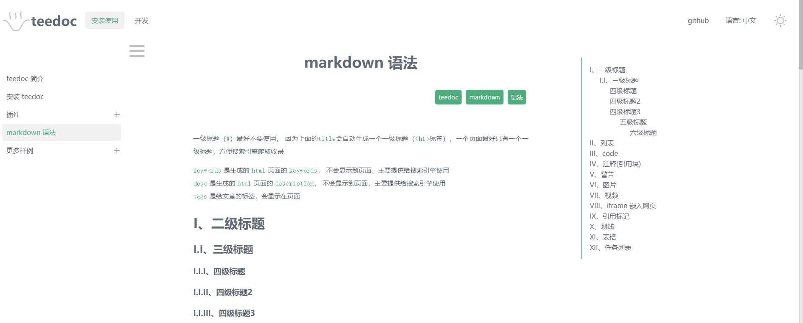

teedoc
===========
[中文 README](./README_ZH.md)

Official site: [teedoc.github.io](https://teedoc.github.io/)

documentation generate tool from markdown and jupyter notebook to html

`teedoc` can be used in the following scenarios:
* Build a document website, and it is best to support multiple documents and custom pages
* Build a `WiKi` website
* Build personal or corporate knowledge base
* Build personal or corporate website

## Features

- [x] Easy to use, cross platform, only need `Python3`
- [x] Easy to deploy, only copy generated staitc HTML files to your server or other host
- [x] Easy to write, markdown support
- [ ] Jupyter notebook support
- [x] Multiple docs support
- [x] Plugin support
- [x] Multiple theme support(support by plugin)
- [x] Multi-level directory support
- [x] Multiple language support(manually translate)
- [ ] Multiple language support(auto translate)
- [x] Multiple version support
- [x] Search support
- [x] SEO friendly
- [x] Real-time preview file changes
- [x] Multiple thread support, faster build speed
- [ ] Blog support

## Get Started

Visit official site: [teedoc.github.io](https://teedoc.github.io/)

