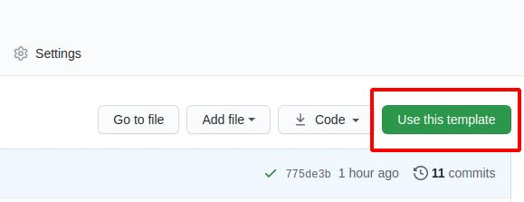

## 使用方法

需要先安装`Python3` （仅支持 `Python3`）

比如在`Ubuntu`上：
```
sudo apt install python3 python3-pip
```

`Windows` 和 `macOS`请到[官网下载](https://www.python.org/downloads/)


### 安装

打开终端，输入：

```
pip3 install teedoc
```

以后使用以下命令来更新软件：
```
pip3 install teedoc --upgrade
```

现在你可以在终端使用 `teedoc` 命令了

如果不能，请检查是不是`Python`可执行目录没有加入到环境变量 `PATH`,
比如可能在 `~/.local/bin`


### 构建网页

* 获取文档模板工程

```
git clone https://github.com/teedoc/teedoc.github.io my_site
```

* 安装插件

这会根据`site_config.sjon`中的`plugins`的插件设置安装插件

```
cd my_site
teedoc install
```

* 构建 `HTML` 页面并起一个`HTTP`服务

```
teedoc serve
```

这个命令会先构建所有`HTML`页面以及拷贝资源文件，然后起一个`HTTP`服务
如果只需要生成页面，使用

```
teedoc build
```


在显示 `Starting server at 0.0.0.0:2333 ....` 后，就可以了

打开浏览器访问: [http://127.0.0.1:2333](http://127.0.0.1:2333)


同时可以看到目录下多了一个`out`目录，里面就是生成的静态网站内容，直接拷贝到服务器使用`nginx`或者`apache`进行部署即可


### 在 github 上基于模板仓库创建新仓库


访问 [https://github.com/teedoc/teedoc.github.io](https://github.com/teedoc/teedoc.github.io)

点击 `Use this template`



然后填写新的仓库名称和描述，基于这个仓库新建一个你自己的仓库，现在你获得了和 `teedoc`官网一模一样的仓库了

然后使用`git clone 你的仓库地址`就可以克隆到本地了


