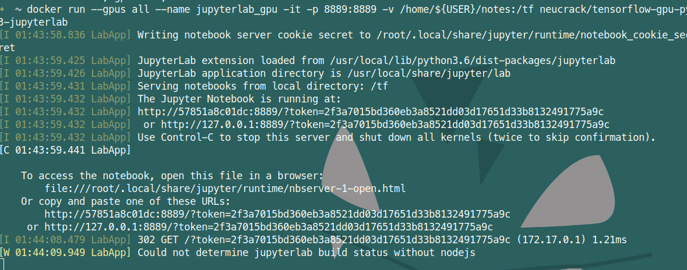
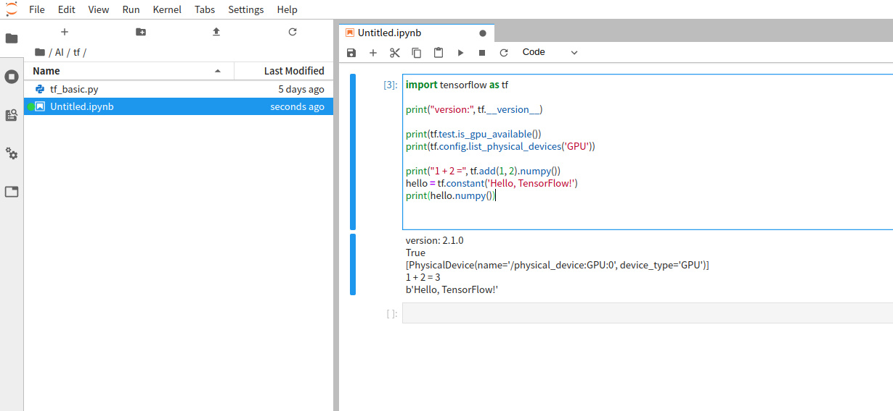

> 版权声明：本文为 neucrack 的原创文章，遵循 CC 4.0 BY-SA 版权协议，转载请附上原文出处链接及本声明。
> 原文链接：[https://neucrack.com/p/116](https://neucrack.com/p/116)


这里使用 docker ， 安装环境更加简单（只需要装 NVIDIA 驱动，不需要装cuda，当然也不用为cuda版本烦恼）稳定～
而且可以同时运行多个 docker，比如同时运行多个 jupyterlab 给不同人使用

## 安装docker

安装 docker，**版本必须是19.03及以上**（可以使用`docker --version` 查看），如果版本低于这个版本，后面使用`nvidia-docker` 驱动就会失败，会提示找不到`--gpu all` 参数

### 安装

* 如果是Manjaro， 直接`yay -S docker`
* 其他发行版：

参见官方教程：https://docs.docker.com/install/linux/docker-ce/debian/

> deepin 是基于 debian 9.0
> 如果是 deepin 则需要修改 `sudo vim /usr/share/python-apt/templates/Deepin.info` 里面的unstable为stable
> 并使用命令`sudo add-apt-repository  "deb [arch=amd64] https://download.docker.com/linux/debian stretch stable"`

### 设置代理

如果下载慢，可能需要设置代理， 也可以不使用官方镜像，使用国内的镜像，比如 daocloud 镜像加速

docker 代理设置参考： https://neucrack.com/p/286

pull 镜像的时候可以设置代理让拉取更快， 创建容器时建议将代理去掉


### 设置当前用户可以访问docker（非root）

参考这里： https://docs.docker.com/install/linux/linux-postinstall/

```
sudo groupadd docker
sudo usermod -aG docker $USER
newgrp docker # 或者重新开启终端即可，如果未生效，可重启
```


### 常用命令


`docker images `: 列出镜像列表
`docker run [options] image_name [command]`：从镜像新建一个容器
`docker ps `: 正在运行的容器
`docker ps -a`: 所有容器，包括没有正在运行的
`docker rm container_name`：删除容器
`docker rmi image_name`：删除镜像
`docker start container_name`：启动容器
`docker attatch container_name`：附着到容器里
`docker exec conrainer_name [comand]`：在容器中执行命令
`docker logs container_name`: 查看容器执行log

`docker build -t image_name .`：从 Dockerfile 构建一个镜像


### docker run 常用参数

`-it`：启用交互式终端
`-rm`：及时删除，不保存容器，即退出后就删除
`--gpus all`：启用所有GPU支持
`-p port1:port2`：宿主机和容器端口映射，port1为宿主机的端口
`-v volume1:volume2`：宿主机和容器的磁盘映射， volume1是宿主机的文件夹，比如映射`/home/${USER}/notes`到`/tf/notes`
`--name name`：给容器取名，如果没有这个参数，名字就是随机生成的
`--device device:container_device`：挂在设备，比如`/dev/ttyUSB0:/dev/ttyUSB0`
`--network=host`： 使用宿主机的网络
`--restart`: 自动启动, 可以用这个设置开机自启, 如果run的时候忘了可以用`docker update --restart=always 容器名`来更新
```
no:		                     不自动重启容器. (默认value)
on-failure:               容器发生error而退出(容器退出状态不为0)重启容器
unless-stopped: 	在容器已经stop掉或Docker stoped/restarted的时候才重启容器
always:                  在容器已经stop掉或Docker stoped/restarted的时候才重启容器
```


## 安装显卡驱动

显卡安装部分独立写了一篇， 参考[Linux Nvidia显卡安装](https://neucrack.com/p/252)

## 安装镜像

参考官方文档：https://www.tensorflow.org/install/docker

比如我这里Ubuntu：（一定看文档，可能会不一样，有更新）

* 安装 [nvidia-docker](https://github.com/NVIDIA/nvidia-docker)

按照 `readme` 中的` installation guide` 安装即可， 比如 `Ubuntu`：

```
# Add the package repositories
distribution=$(. /etc/os-release;echo $ID$VERSION_ID)
curl -s -L https://nvidia.github.io/nvidia-docker/gpgkey | sudo apt-key add -
curl -s -L https://nvidia.github.io/nvidia-docker/$distribution/nvidia-docker.list | sudo tee /etc/apt/sources.list.d/nvidia-docker.list

sudo apt-get update && sudo apt-get install -y nvidia-container-toolkit
sudo systemctl restart docker
```

如果是deepin，则需要改一下系统版本
```
distribution="ubuntu18.04"
curl -s -L https://nvidia.github.io/nvidia-docker/gpgkey | sudo apt-key add -
curl -s -L https://nvidia.github.io/nvidia-docker/$distribution/nvidia-docker.list | sudo tee /etc/apt/sources.list.d/nvidia-docker.list

sudo apt-get update && sudo apt-get install -y nvidia-container-toolkit
sudo systemctl restart docker
```

如果是 Manjaro， 只需要命令 `yay -S nvidia-docker` 即可！（如果遇到下载慢，可以使用poipo设置全局代理，参考[终端代理设置方法](https://neucrack.com/p/275)）

* 测试 nvidia-docker 以及cuda能不能使用起来

使用`nvidia/cuda`这个镜像，这个镜像只是用来测试，用完也可以删掉，如果没有设置代理，不想花费太多时间拉取镜像，可以不用这个镜像，直接使用`tensorflow/tensorflow:latest-gpu-py3`这个镜像或者`neucrack/tensorflow-gpu-py3-jupyterlab`(或 `daocloud.io/neucrack/tensorflow-gpu-py3-jupyterlab`)这个镜像（推荐）（在前者的基础上装了jupyterlab， 而且做了更好的用户权限管理）

```
lspci | grep -i nvidia
docker run --gpus all --rm nvidia/cuda nvidia-smi
```

比如：
```
➜  ~ sudo docker run --gpus all --rm nvidia/cuda nvidia-smi
Tue Mar 10 15:57:12 2020       
+-----------------------------------------------------------------------------+
| NVIDIA-SMI 440.64       Driver Version: 440.64       CUDA Version: 10.2     |
|-------------------------------+----------------------+----------------------+
| GPU  Name        Persistence-M| Bus-Id        Disp.A | Volatile Uncorr. ECC |
| Fan  Temp  Perf  Pwr:Usage/Cap|         Memory-Usage | GPU-Util  Compute M. |
|===============================+======================+======================|
|   0  GeForce GTX 106...  Off  | 00000000:01:00.0  On |                  N/A |
| 33%   39C    P0    27W / 120W |    310MiB /  6075MiB |      0%      Default |
+-------------------------------+----------------------+----------------------+
                                                                               
+-----------------------------------------------------------------------------+
| Processes:                                                       GPU Memory |
|  GPU       PID   Type   Process name                             Usage      |
|=============================================================================|
+-----------------------------------------------------------------------------+

```

```
Wed Mar 11 02:04:26 2020       
+-----------------------------------------------------------------------------+
| NVIDIA-SMI 430.40       Driver Version: 430.40       CUDA Version: 10.1     |
|-------------------------------+----------------------+----------------------+
| GPU  Name        Persistence-M| Bus-Id        Disp.A | Volatile Uncorr. ECC |
| Fan  Temp  Perf  Pwr:Usage/Cap|         Memory-Usage | GPU-Util  Compute M. |
|===============================+======================+======================|
|   0  GeForce GTX 108...  Off  | 00000000:04:00.0 Off |                  N/A |
| 35%   41C    P5    25W / 250W |      0MiB / 11178MiB |      0%      Default |
+-------------------------------+----------------------+----------------------+
|   1  GeForce GTX 108...  Off  | 00000000:81:00.0 Off |                  N/A |
| 39%   36C    P5    19W / 250W |      0MiB / 11178MiB |      2%      Default |
+-------------------------------+----------------------+----------------------+
                                                                               
+-----------------------------------------------------------------------------+
| Processes:                                                       GPU Memory |
|  GPU       PID   Type   Process name                             Usage      |
|=============================================================================|
|  No running processes found                                                 |
+-----------------------------------------------------------------------------+
```

如果驱动版本太低，这里就会提示需要更新驱动

同时注意到cuda版本是10.2，可能tensorflow只支持到10.1，如果是在宿主机上直接装tensorflow就会报错不支持，这里用docker的好处就体现了，不用理会，只需要保证驱动装好就可以了

deepin 出现了错误
```
docker: Error response from daemon: OCI runtime create failed: container_linux.go:349: starting container process caused "process_linux.go:449: container init caused \"process_linux.go:432: running prestart hook 0 caused \\\"error running hook: exit status 1, stdout: , stderr: nvidia-container-cli: ldcache error: open failed: /sbin/ldconfig.real: no such file or directory\\\\n\\\"\"": unknown.
```
参考这里的解决方法：https://github.com/NVIDIA/nvidia-docker/issues/614 ，解决：
```
ln -s /sbin/ldconfig /sbin/ldconfig.real
```

docker 出现错误：`nvidia-container-cli: initialization error: cuda error: unknown error`
重启系统得到解决

## 运行 tensorflow with GPU


拉取镜像，直接拉取
```
docker pull neucrack/tensorflow-gpu-py3-jupyterlab
# docker pull tensorflow/tensorflow:latest-gpu-py3-jupyter
# docker pull tensorflow/tensorflow
# docker pull tensorflow/tensorflow:latest-gpu
```
国内可以使用放在 daocloud 的镜像，速度会快一些：
```
docker pull daocloud.io/neucrack/tensorflow-gpu-py3-jupyterlab
```

执行测试语句：
```
docker run --gpus all -it --rm neucrack/tensorflow-gpu-py3-jupyterlab python -c "import tensorflow as tf; print('-----version:{}, gpu:{}, 1+2={}'.format(tf.__version__, tf.test.is_gpu_available(), tf.add(1, 2).numpy()) );"
```
> 如果使用了daocloud，镜像名需要修改成`daocloud.io/neucrack/tensorflow-gpu-py3-jupyterlab`

如果没问题，就会出现以下输出（会伴随一大堆调试信息，也可能有警告信息，可以仔细看一下）：
```
-----version:2.1.0, gpu:True, 1+2=3
```

## Jupyterlab

```
docker run --gpus all --name jupyterlab-gpu -it -p 8889:8889 -e USER_NAME=$USER -e USER_ID=`id -u $USER` -e GROUP_NAME=`id -gn $USER` -e GROUP_ID=`id -g $USER` -v /home/${USER}:/tf neucrack/tensorflow-gpu-py3-jupyterlab
```
> 如果使用了daocloud，镜像名需要修改成`daocloud.io/neucrack/tensorflow-gpu-py3-jupyterlab`


然后就能用浏览器在`http://127.0.0.1:8889/`地址使用 `jupyterlab`了，而且目录对应了设置的`/home/${USER}`目录





退出直接`Ctrl+C`即可
这个容器创建后会一直存在于电脑里，可以使用`docker ps -a`查看到，下次启动使用
```
docker start jupyterlab_gpu
```
也可以附着到容器：
```
docker attatch jupyterlab_gpu
```
停止容器：
```
docker stop jupyterlab_gpu
```

删除容器：
```
docker rm jupyterlab_gpu
```

修改 user 和 root 密码, 这样就可以使用 `sudo` 命令了
```
docker exec -it jupyterlab_gpu /bin/bash
passwd $USER
passwd root
```


如果需要每次都重新新建一个容器，用完就删除，只需要在`run`命令后面添加一个`-rm`参数即可

## 其它问题

* 运行程序时提示： ResourceExhaustedError: OOM when allocating tensor with shape[784,128] 

使用`nvidia-smi`查看内存使用情况

tensorflow会一次性申请（几乎）所有显存：

```
➜  ~ nvidia-smi
Fri Mar 20 09:18:48 2020       
+-----------------------------------------------------------------------------+
| NVIDIA-SMI 435.21       Driver Version: 435.21       CUDA Version: 10.1     |
|-------------------------------+----------------------+----------------------+
| GPU  Name        Persistence-M| Bus-Id        Disp.A | Volatile Uncorr. ECC |
| Fan  Temp  Perf  Pwr:Usage/Cap|         Memory-Usage | GPU-Util  Compute M. |
|===============================+======================+======================|
|   0  GeForce GTX 108...  Off  | 00000000:04:00.0  On |                  N/A |
|  0%   48C    P2    60W / 250W |  10726MiB / 11178MiB |      0%      Default |
+-------------------------------+----------------------+----------------------+
|   1  GeForce GTX 108...  Off  | 00000000:81:00.0 Off |                  N/A |
|  0%   47C    P2    58W / 250W |    197MiB / 11178MiB |      0%      Default |
+-------------------------------+----------------------+----------------------+
                                                                               
+-----------------------------------------------------------------------------+
| Processes:                                                       GPU Memory |
|  GPU       PID   Type   Process name                             Usage      |
|=============================================================================|
|    0      3099      G   /usr/lib/xorg/Xorg                            21MiB |
|    0     40037      C   /usr/bin/python3                           10693MiB |
|    1     40037      C   /usr/bin/python3                             185MiB |
+-----------------------------------------------------------------------------+

```

有可能是使用显存的进程太多了，可以适当退出一些进程；
也有可能申请内存重复了 ，可以尝试重启容器解决

* 一直运行没有结果

重启docker 容器解决，总之遇事不决，重启解决。。

* 提示`could not retrieve CUDA device count: CUDA_ERROR_NOT_INITIALIZED`

可能使用了多进程, 新的进程直接拷贝了当前进程的环境,导致错误, 解决办法是**父进程需要引入**, 在子进程中需要使用的时候单独import,而不是写到全局, 参考这里: https://abcdabcd987.com/python-multiprocessing/

* `ImportError: libGL.so.1: cannot open shared object file: No such file or directory`

```
apt install libgl1-mesa-glx
```

* `Failed to get convolution algorithm. This is probably because cuDNN failed to initialize`

显卡内存不足，检查是不是被其它程序占用了，如果多张显卡，可以设置环境变量`CUDA_VISIBLE_DEVICES`来设置将要使用的显卡， 比如这里共有三张显卡， 下标分别是`0`，`1`，`2`， 选择第三张卡则设置为`2`

```python
import os

os.environ["CUDA_VISIBLE_DEVICES"] = '2'

```


## 参考

* [https://blog.csdn.net/liuzk2014/article/details/83190267](https://blog.csdn.net/liuzk2014/article/details/83190267)
* https://devtalk.nvidia.com/default/topic/1047416/linux/nvidia-driver-is-not-loaded-ubuntu-18-10-/

* https://github.com/tensorflow/tensorflow/issues/394


