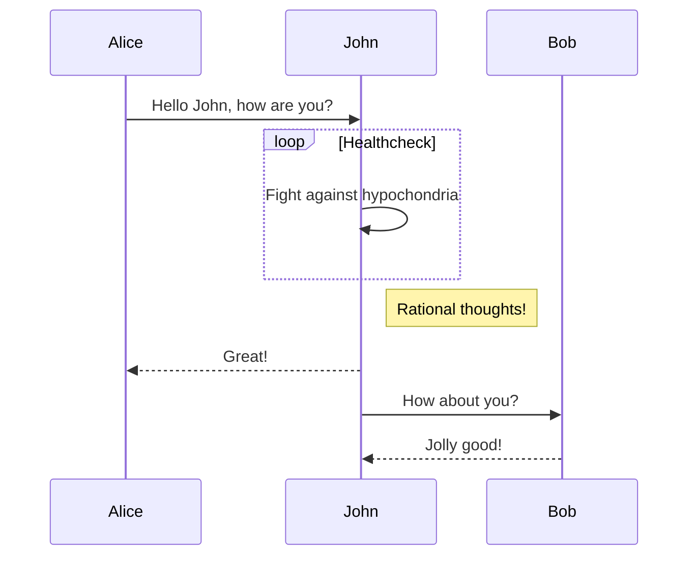

本文是使用`Markdown`编写的文档，使用`teedoc`生成的页面效果， `Markdown`文件见[这里](https://github.com/teedoc/teedoc.github.io/blob/main/docs/get_started/zh/syntax/syntax_markdown.md)

## Markdown 基本文件内容格式

需要先在`site_config.json`中确认有`markdown`解析插件启用了，比如`teedoc-plugin-markdown-parser`。

在`config.json`对应的目录下建立文件夹或者文件， 比如`get_started/zh/syntax/syntax_markdown.md` (`README.md`最终会生成`index.html`)， 然后编写内容：

### Markdown 文件头

添加一个头

```markdown
---
title: markdown 语法
tags: teedoc, markdown, 语法
keywords: teedoc, markdown, 语法
desc: teedoc 的 markdown 语法介绍和实例
id: zh_readme
class: zh_readme
# 以 # 号开头表示注释
---
```

通过这些键值来设置文章信息：
* `title`: 文章的标题
* `keywords`: 关键词，多个关键词用英文逗号`,` 隔开，会被添加到`html`头中，方便搜索引擎爬取，不会显示到页面
* `desc`: 页面描述，会被添加到`html`头中，方便搜索引擎爬取
* `tags`： 文章标签，会显示到页面
* `id`: 页面`id`， 会被添加到`html`标签中，比如`<html id="zh_readme">...</html>`, 可以不设置，会覆盖`config.json`中的设置
* `class`: 页面`class`,多个用英文逗号`,`隔开，可以不设置，会覆盖`config.json`中的设置。比如可以通过设置这个值来达到设置特定页面的`css`样式。具体支持的样式见[主题插件的文档](../plugins/themes.md)
* `layout`: 页面使用的布局模板, 默认不需要这个键值, 会使用主题插件里面的配置,需要你需要自定义这个页面的布局, 可以设置这个参数, 路径相对于`site_config`中的`layout_root_dir`路径, `layout_root_dir` 默认为`layout`, 所以要使用`layout/special_layout.html` 只需要填写`special_layout.html`. 布局模板语法见[layout 文档](../usage/layout_template.md)

另外以`#`号开头则代表是注释

### Markdown 文件内容

内容就是使用`Markdown`语法进行编写，因为标题会被转成`<h1>`标签，所以内容中建议从二级标题开始，这样一个页面只有一个`<h1>`标签，方便搜索引擎爬取，比如
```markdown
---
title: teedoc
keywords: teedoc, markdown, jupyter notebook, html, 文档生成, 替代gitbook, 网站生成, 静态网站
desc: teedoc， 将 markdown 或者 jupyter notbook 转换成 html 静态网页
id: zh_readme
class: zh_readme
---


## 标题一

内容。。。

## 标题二

内容。。。
```


一级标题（`#`）最好不要使用， 因为上面的`title`会自动生成一个一级标题（`<h1>`标签），一个页面最好只有一个一级标题，方便搜索引擎爬取收录

`keywords` 是生成的 `html` 页面的 `keywords`， 不会显示到页面，主要提供给搜索引擎使用
`desc` 是生成的 `html` 页面的 `description`， 不会显示到页面，主要提供给搜索引擎使用
`tags` 是给文章的标签，会显示在页面


## 二级标题 {#custom-id1}

### 三级标题 {#custom-id2}

#### 四级标题

#### 四级标题2

#### 四级标题3

##### 五级标题

###### 六级标题

最多 6 级标题

## 链接

[相对路径， README.md 文件](../README.md): `../README.md`， 会自动转换成`index.html`

[相对路径， md 文件](./syntax_markdown.md)： `./syntax_markdown.md`， 会转成文档的 `.html` 结尾的链接

[绝对路径， http 文件](https://storage.googleapis.com/tensorflow_docs/docs-l10n/site/zh-cn/tutorials/quickstart/beginner.ipynb)： `https://。。。/beginner.ipynb`，原链接，不会修改

[相对路径， ipynb 文件](./syntax_jupyter.ipynb)： `./syntax_jupyter.ipynb`， 会转成文档的 `.html` 结尾的链接


## 列表

列表项:
* 包子
* 馒头
* 茶叶蛋


* aaaaaaa
  * 二级列表
  * 二级列表
  * 二级列表
* bbbbbb


## code

这是一段行内代码`print("hello")`，或者强调`teedoc`

```python
print("hello")

print("world")
```

```c
#include "stdio.h"

int main()
{
    printf("hello world");
}
```


## 注释(引用块)

下面是一段注释
> 这里是一段注释 (`<blockquote></blockquote>`)
> 这是注释的第二行
```python
# 这里是注释里面的代码段
print("hello")
```


> 注释
>> 注释嵌套
>> 注释嵌套

在块引用中使用 markdown 语法

> #### The quarterly results look great!
>
> - Revenue was off the chart.
> - Profits were higher than ever.
>
>  *Everything* is going according to **plan**.
> ```c
> printf("hello");
> ```


## 警告

下面是一段警告信息

>! 这是一段警告信息(`<blockquote class="spoiler"></blockquote>`)

## 图片

要显示这张图片，需要在`site_config.json`中设置`route`键值


## 视频


```html
<video src="https://****.com/***.mp4" controls="controls" preload="auto">your brower not support play video</video>
```

这里没有放视频， 所以是空白, 放入正确的视频就可以播放了

<video src="" controls="controls" preload="auto">your brower or site not support play video</video>


## iframe 嵌入网页

<iframe src="//player.bilibili.com/player.html?aid=52613549&bvid=BV144411J72P&cid=92076022&page=1" scrolling="no" border="0" frameborder="no" framespacing="0" allowfullscreen="true" style="width:43vw;height:34vw;min-width: 85%;"> </iframe>


## 引用标记

我能干饭我自豪。[^干饭人]

[^干饭人]: 老子说道
这会在文章末尾进行注解


## 划线

我是~~天神~~打工人啊


## 表格


| Header 1 | *Header* 2 |
| -------- | -------- |
| `Cell 1` | [Cell 2](http://example.com) link |
| Cell 3 | **Cell 4** |


## 任务列表

- [x] 任务1
- [x] 任务2
- [ ] 任务3
- [ ] 任务4


## 标题链接(页内跳转)


比如要跳转到标题[Markdown 文件头](#Markdown-文件头), 只需
```markdown
[Markdown 文件头](#Markdown-文件头)
```

这里空格使用了减号`-`替换


## HTML

```html
<div class="hello">
hello  
</div>
```

注意这里没有空行, 效果如下

<div class="hello">
hello <br/> 
</div>


## 数学

支持`tex`和`Latex`语法，以及`MathML`标签

两种写法，
* 一种是行内内嵌，用`$`符号将方程包起来，比如
```markdown
质能方程 $E=mc^2$大家很熟悉吧
```
> 效果:
> 质能方程 $E=mc^2$大家很熟悉吧

* 另一种，块方程，用`$$`将方程包起来，比如
```markdown
$$
E=mc^2
$$
```
> 效果:
> $$
> E=mc^2
> $$

其他例子：
常见：
```markdown
When $a \ne 0$, there are two solutions to $ax^2 + bx + c = 0$ and they are
$$
x = {-b \pm \sqrt{b^2-4ac} \over 2a}.
$$
```

> When $a \ne 0$, there are two solutions to $ax^2 + bx + c = 0$ and they are
> $$
> x = {-b \pm \sqrt{b^2-4ac} \over 2a}.
> $$

除法式：

```markdown
$$
\require{enclose}
\begin{array}{r}
                13  \\[-3pt]
4 \enclose{longdiv}{52} \\[-3pt]
     \underline{4}\phantom{2} \\[-3pt]
                12  \\[-3pt]
     \underline{12}\\0
\end{array}\\
$$
```

> $$
> \require{enclose}
> \begin{array}{r}
>                 13  \\[-3pt]
> 4 \enclose{longdiv}{52} \\[-3pt]
>      \underline{4}\phantom{2} \\[-3pt]
>                 12  \\[-3pt]
>      \underline{12}\\0
> \end{array}\\
> $$


加框：

```markdown
$$
\bbox[#cde, 3px,border:1px solid blue]{y=x^2-1}
$$
```

> $$
> \bbox[#cde, 3px,border:1px solid blue]{y=x^2-1}
> $$


## mermaid 支持

使用 mermaid 可以画很多类型的图表， 详细的语法和支持请看[官网](https://mermaid-js.github.io/)

<pre class="language-markdown">
<code>

</code>
</pre>

或者直接 `html`:

```html
<div class="mermaid">
sequenceDiagram
  Alice->>John: Hello John, how are you?
  loop Healthcheck
      John->>John: Fight against hypochondria
  end
  Note right of John: Rational thoughts!
  John-->>Alice: Great!
  John->>Bob: How about you?
  Bob-->>John: Jolly good!
</div>
```

效果：


## 标签页（tabset）支持

> 试验性功能，因为不是标准 Markdown 语法，目前仅 teedoc 支持，所以根据你的需求选择使用
> 当然也欢迎将格式推广到其它解析器

效果：

.. tabset::标签页标题（可选）
    :id: tabset1

    ## 标签一

    内容一，可以使用 Markdown 语法
    ```kotlin
      fun main() {
          println("Hello World")
      }
    ```

    ## 标签二

    内容二，可以使用 Markdown 语法
    ```java
      public class Main {
          public static void main(String[] args) {
              System.out.println("Hello World");
          }
      }
    ```

在选中一个页面中的某个标签时，会自动选中相同`id`的标签页中的相应标签，不相同`id`或者没设置`id`则不会。

.. tabset::标签页标题（可选）
    :id: tabset1

    ## 标签一

    内容一，可以使用 Markdown 语法
    ```kotlin
      fun main() {
          println("Hello World")
      }
    ```

    ## 标签二

    内容二，可以使用 Markdown 语法
    ```java
      public class Main {
          public static void main(String[] args) {
              System.out.println("Hello World");
          }
      }
    ```

.. tabset::标签页标题（可选）

    ## 标签一

    内容一，可以使用 Markdown 语法
    ```kotlin
      fun main() {
          println("Hello World")
      }
    ```

    ## 标签二

    内容二，可以使用 Markdown 语法
    ```java
      public class Main {
          public static void main(String[] args) {
              System.out.println("Hello World");
          }
      }
    ```

源码：
```
效果：
（注意这里需要空一行）
.. tabset::标签页标题（可选）
    :id: tabset1

    ## 标签一

    内容一，可以使用 Markdown 语法
    ```kotlin
      fun main() {
          println("Hello World")
      }
    ```

    ## 标签二

    内容二，可以使用 Markdown 语法
    ```java
      public class Main {
          public static void main(String[] args) {
              System.out.println("Hello World");
          }
      }
    ```
```

## 详情页（details）支持

> 试验性功能，因为不是标准 Markdown 语法，目前仅 teedoc 支持，所以根据你的需求选择使用
> 当然也欢迎将格式推广到其它解析器

这是对 `HTML5` `details`标签的一种 `Markdown` 语法， `HTML`这样写:
```html
<details>
  <summary>标题，点击展开</summary>
  <div class="details-content">
    <p>这里是内容</p>
  </div>
</details>
```

效果：

.. details::标题，点击展开

    内容一，可以使用 Markdown 语法
    ```kotlin
      fun main() {
          println("Hello World")
      }
    ```

.. details::标题，默认展开
    :open: true

    内容一，可以使用 Markdown 语法
    ```kotlin
      fun main() {
          println("Hello World")
      }
    ```

源码：
```
.. details::标题，点击展开

    内容一，可以使用 Markdown 语法
    ```kotlin
      fun main() {
          println("Hello World")
      }
    ```

.. details::标题，默认展开
    :open: true

    内容一，可以使用 Markdown 语法
    ```kotlin
      fun main() {
          println("Hello World")
      }
    ```
```


