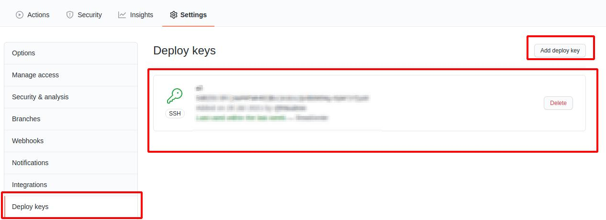
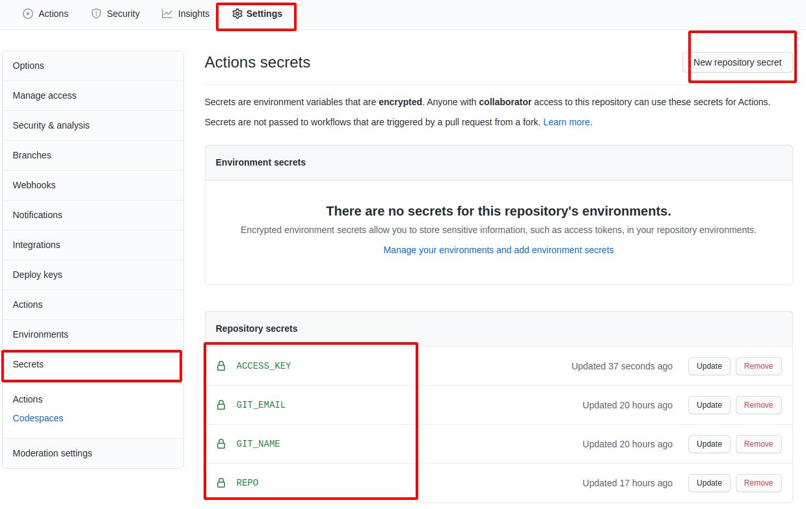
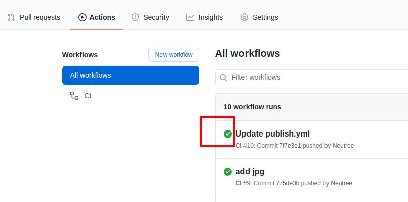
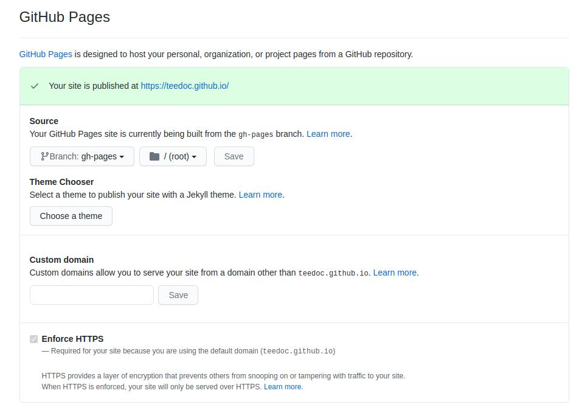

## 克隆模板仓库

访问 [https://github.com/teedoc/teedoc.github.io](https://github.com/teedoc/teedoc.github.io)
点击 `Use this template`

然后填写新的仓库名称和描述，基于这个仓库新建一个你自己的仓库，现在你获得了和 `teedoc`官网一模一样的仓库了
> 会发现有一个`.github/workflows`的目录，这个就是`github action`的配置文件，我们利用这个功能来实现：
> 当我们更新仓库的源文件时， `github action`自动根据这个配置文件的命令构建生成静态网页，然后推送到这个仓库的`gh-pages`分支

## 生成 ssh 密钥

然后在本地生成一对`key`（windows下需要先安装相关软件，请自行安装（安装git就会有））
```
ssh-keygen -t rsa -f key.txt 
```
得到了`key.txt`和 `key.key.pub`两个文件

## 设置密钥

到文档项目的设置里面设置`ssh`密钥, 添加一个`ssh`密钥， 拷贝 `key.txt.pub` 中的内容，注意是`pub`文件，即公钥，名字随便取


然后点击`Secrets`，设置秘密键值对， 需要设置的变量有：
* `ACCESS_KEY`: 复制`key.txt`中的内容
* `GIT_EMAIL`: 设置一个`git`提交邮箱，设置你的`github`邮箱即可
* `GIT_NAME`: 设置一个`git`提交名字，设置你的`github`名字即可
* `REPO`: 仓库地址， 设置为`组织名/仓库名`或者`用户名/仓库名`，比如`teedoc/teedoc.github.io`即可



## 触发构建

像仓库提交一次修改，会自动触发构建， 可以在`Actions`栏看到进度和日志

如果是绿色的勾， 就代表成功了，否则就是失败了，可以点进去看构建日志报了什么错，一般都是前面的值填错了



## 设置 pages 服务

然后在设置里面找到 `pages` 服务设置，打开即可，然后访问对应的域名，
比如这里是`https://teedoc.github.io/`

>! 注意如果跟路径不是`/`，而且没有自定义域名，比如`https://teedoc.github.io/my_site/`， 则需要在`site_config.json`中配置`"site_root_url":"/my_site/"`




